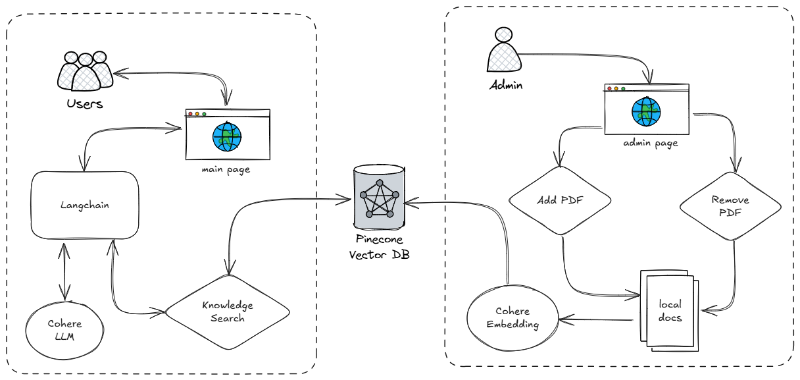

# This is RAG based AI Agent

### Setup .env file like .env.example
After adding all the variables follow the instruction to run the project

## Instruction to run the project
- Install UV if you don't have it
    ```bash
    pip install uv
    ```
- Install packages
    ```bash
    uv sync --no-dev
    ```
- Run the project
    ```bash
    uv run streamlit run app/main.py
    ```

## Project Design

